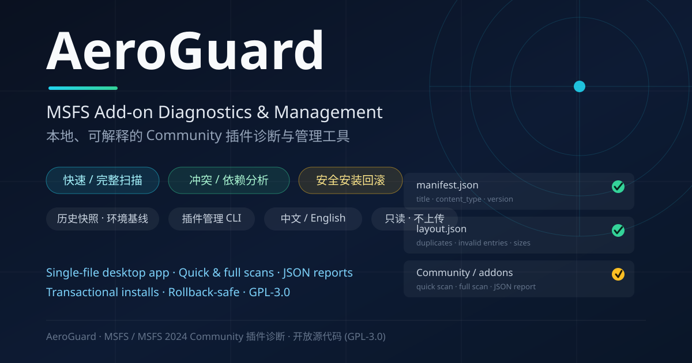

# AeroGuard



> Local, explainable add-on diagnostics & environment health checks for **Microsoft Flight Simulator**.

AeroGuard is an open-source MSFS add-on diagnostics tool (in development) that inspects the structure, metadata, and file consistency of add-on packages under your Community folder, and reports potential issues in the most explainable way possible.

The project is still in its early development phase. The current focus is on building reliable, deterministic local scanning and analysis.

> ⚠️ AeroGuard flagging an anomaly does not mean the add-on actually fails at runtime.

---

## ✈️ What AeroGuard does

The current version scans add-ons in an MSFS Community folder and checks:

- `manifest.json` metadata
- Whether `layout.json` exists
- Whether `layout.json` parses correctly
- Whether `layout.json` contains invalid entries
- Whether `layout.json` contains duplicate paths
- Whether declared files actually exist
- Whether actual file sizes match `layout.json`
- Whether the add-on folder contains files not declared in `layout.json`
- Aggregating findings per add-on
- Counting findings per rule
- Ranking add-ons by number of findings
- A priority-review ranking
- Classifying missing / size-mismatched / unlisted files by potential runtime impact
- Quick scan / full scan
- Optional JSON report output (full details, machine-readable)
- Non-interactive CLI usage with command-line arguments
- Marking a scan as incomplete when parts of the file tree cannot be read (instead of falsely reporting missing files)
- Recording traversal time per indexed add-on in full scans, with hot-spot rankings in the terminal and JSON
- Recognizing CRLF → LF line-ending normalization through stratified sampling of large size-mismatch batches, then transparently downgrading them
- Detecting resource-override candidates where multiple packages declare the same VFS-relative path
- Recognizing intentional overrides via Package Order Hints, dependency declarations, and global override declarations
- Identifying airport-duplication candidates using multiple signals from package name, title, and layout paths
- Analyzing dependencies within the current scan root, out-of-scope dependencies, and dependency cycles
- Explicitly enabling / disabling Community packages and saving repeatable Profiles
- Moving suspicious packages into a quarantine area outside the Community and restoring them to their prior state
- Path-safety, structure, and file-consistency checks for folder or ZIP install sources
- Keeping transactional backups when installing or replacing add-ons, with safe rollback
- Listing enabled, disabled, quarantined, backed-up, and rolled-back versions
- A native desktop UI for background scans, browsing details, exporting reports, and management
- Compact scan history with named environment baselines and diffs of add-ons, findings, conflicts, and dependencies
- Ignoring OS/file-manager junk such as Thumbs.db / .DS_Store
- Local knowledge records (manual notes per add-on / rule — a local seed of a known-issue database)
- Rule overrides: ignore or downgrade a rule for a specific add-on, surfaced in reports and the GUI
- Single add-on check: `manage verify PACKAGE` (or the GUI button) runs a read-only consistency check on one installed package
- Report export in JSON, Markdown, or standalone HTML — the Markdown/HTML reports include per-rule handling guidance

`main.py`'s scan flow is always read-only. `manage.py` only moves or installs explicitly named packages when you run a management sub-command; by default it stores state, disabled packages, and backups in `.aeroguard/` next to the Community, and never touches `Official*`, `UserCfg.opt`, or the simulator's `Content.xml`.

---

## 🛡️ Design principles

AeroGuard tries to keep the following concepts distinct.

### Finding (检测事实)

Objective facts the scanner can establish.

Example:

```text
layout.json declares a file, but that file does not exist in the add-on folder.
```

### Severity

How obvious the package's internal inconsistency is.

Current values:

```text
ERROR
WARNING
INFO
```

### Impact (potential runtime impact)

Whether an anomaly might affect the add-on at runtime in MSFS.

Current values:

```text
POTENTIALLY_RUNTIME
LIKELY_NON_RUNTIME
UNKNOWN
```

Where:

- `POTENTIALLY_RUNTIME`: may involve actual runtime assets
- `LIKELY_NON_RUNTIME`: more likely documentation, build tools, or install helpers
- `UNKNOWN`: current rules cannot judge reliably

AeroGuard will not declare that an add-on developer shipped broken software based only on local scan results.

For example, AeroGuard prefers reporting:

> The installed add-on content differs from its own metadata.

rather than:

> This add-on is broken.

---

## 🔍 Scan modes

### Quick scan

Checks mainly:

- `manifest.json`
- `layout.json`
- Layout data structure
- Duplicate paths
- Invalid entries

A quick scan does not walk the whole add-on file tree. Good for routine checks.

### Full scan

Everything in the quick scan, plus:

- Missing files
- File-size mismatches
- Unlisted files

For Communities with many add-ons or many small files, a full scan may take a while.

---

## 🧠 Architecture

```text
AeroGuard/
├── main.py        # CLI entry: interactive / args / JSON reports
├── scanner.py     # Discovers add-on packages and reads manifest metadata
├── analyzer.py    # Runs deterministic consistency rules (issues + perf stats)
├── classifier.py  # Classifies file-level findings by potential runtime impact
├── noise.py       # Reduces high-confidence scan noise with verifiable sampling
├── relationships.py # VFS resource conflicts, airports, and dependency analysis
├── report.py      # Pure data aggregation and JSON report document building
├── management.py  # Enable/disable, Profiles, quarantine, install checks, rollback
├── manage.py      # Add-on management CLI
├── history.py     # Compact scan history, environment baselines, and diffs
├── history_cli.py # History / baseline CLI
├── gui.py         # Native Tk desktop UI and background-task coordination
├── AeroGuard.pyw  # Console-less Windows launch entry
├── launcher.py    # Single-file launcher dispatching GUI and the three CLIs
├── i18n.py        # Lightweight i18n (zh / en catalogs and language resolution)
├── tests/         # Automated tests (stdlib unittest, synthetic fixtures)
└── tools/dev/     # One-off dev/debug scripts (not product code)
```

### `scanner.py`

Discovers add-on packages and reads basic metadata, keeping the original manifest for later features.

### `analyzer.py`

Runs the deterministic consistency rules. `details` always keeps the full item list while `preview` provides a truncated view for terminal display; timing statistics are returned instead of printed to stdout. Full scans build a file index per add-on; with many add-ons the tree enumeration runs across packages concurrently (pure I/O — output is byte-identical to serial), and each add-on's traversal time and file count are recorded to locate large-directory hot spots. Directory-heavy add-ons (e.g. airport scenery with tens of thousands of subdirectories) dominate traversal time.

### `classifier.py`

Classifies missing, size-mismatched, and unlisted files one by one by potential runtime impact, based on path, extension, and directory semantics.

### `noise.py`

Conservative automatic noise reduction. It only considers size-mismatch batches of at least 20 items and selects up to 64 representative samples across top-level directories and extensions. Only when every sample's size difference exactly matches CRLF→LF line-ending normalization is the finding downgraded from WARNING to INFO; the original severity, rule, and sampling evidence remain in the JSON report.

### `report.py`

Display-independent pure aggregation (per-rule statistics, rankings, per-add-on risk, etc.) and construction of the serializable JSON report document.

### `relationships.py`

Cross-package analysis within the current scan root. Resource path overlaps are graded by VFS directory, declared size, and override intent. Intentional resource-level overrides are accepted only via explicit dependency or global-override declarations; Patch Hints are used only as an intent signal among candidates for the same airport code, so unrelated packages are not paired merely because their order groups are adjacent. A default-preferred package is inferred only when all owners share the same Package Order Hint, and is explicitly labeled "default order only", since in-sim package ordering can still be changed.

Airport identification is a conservative heuristic: an airport identifier must be supported by two independent sources — the package name or title, and the layout paths. `airport_code` includes ICAO codes as well as local codes such as `5Z5`, `FVM`. It does not parse BGL internals, so "not identified" does not mean "airport absent"; results should still be confirmed with DevMode VFS/airport tools.

Dependency analysis resolves only packages inside the current scan root. Dependencies not found there are marked `outside_scan_scope`, because they may live in Official, Community2024, or streaming package sources — they are not reported as "missing dependencies".

### `main.py`

The current command-line development/test entry: argument parsing, running the scan pipeline, and presenting text / JSON results.

### `management.py` / `manage.py`

The manager only operates on the Community root given on the command line. Disabling moves the whole package folder into the management state directory; enabling moves it back. Moves require both directories to be on the same disk so a cross-drive copy is never mistaken for an atomic switch. A Profile records the enabled state of packages known at save time; applying it does not change packages added later that are not in the Profile. When disabling or applying a Profile, transactions keep dependency warnings if an add-on that stays enabled explicitly depends on a package being moved out. Directories with a missing or unparseable manifest appear in the inventory but are never written into a Profile automatically.

An install source may be a package folder, a folder of packages, or a ZIP. The manager rejects ZIP path traversal, duplicate paths, symlinks, encrypted entries, and archives over safety limits; it then runs the full consistency check on a staged copy. Sources containing `.exe`, `.dll`, `.bat`, `.cmd`, `.msi`, or `.ps1` require an explicit `--allow-executables`; AeroGuard still never runs those files.

Before replacing an existing package, the original directory is saved under `backups/` by transaction ID. Rollback does not delete the new version; it moves it to `rolled-back/`. If the new version's `manifest.json` or `layout.json` changed after installation, rollback stops to avoid overwriting unknown state. All backups are kept; there is currently no automatic cleanup. Version fields are shown verbatim from the manifest; version ordering is never inferred.

### `gui.py` / `AeroGuard.pyw`

The native desktop UI uses Tk 8.6 bundled with Python 3.12 — no third-party GUI dependency. Scans, install checks, and management operations run on background threads, so the window stays responsive during full scans. The UI offers five tabs: Issues, Conflicts & Dependencies, Add-on Management, Scan Errors, and History & Baselines; double-click a row to view the full JSON data. A "Verify selected add-on" button runs a read-only single-package consistency check; the export dialog writes JSON, Markdown, or HTML (Markdown/HTML include handling guidance). Profiles are dry-run first and show move/warning counts before applying. Closing the window while a background task is running asks for confirmation first, to avoid interrupting an install or rollback.

### `history.py` / `history_cli.py`

History snapshots do not copy tens of thousands of file details from a full report; they store package versions, aggregated findings, scan errors, resource/airport conflicts, dependency state, and evidence digests. Baseline diffs report added, removed, and changed items separately, and warn when the scan mode or Community path differs. History and baselines are written under `.aeroguard/history/`; an existing named baseline is only updated with `--replace`.

---

## 🚧 Current development status

AeroGuard is an early-stage experimental project.

The CLI is currently used mainly for:

- Developing the scan engine
- Validating detection rules
- Collecting real add-on samples
- Calibrating false positives
- Testing anomaly-classification logic
- Performance analysis
- Experimenting with rollback-safe local add-on management under explicit commands

You are currently advised **not** to delete, modify, or reinstall add-ons based purely on AeroGuard scan results.

---

## 🗺️ Roadmap

### Phase 1: Package diagnostics

- [x] Community add-on discovery
- [x] Manifest parsing
- [x] Layout parsing
- [x] Missing-file detection
- [x] File-size anomaly detection
- [x] Unlisted-file detection
- [x] Invalid Layout entry detection
- [x] Duplicate Layout path detection
- [x] Basic impact classifier
- [x] Per-add-on aggregation of results
- [x] Ranking by finding count
- [x] Priority-review ranking
- [x] Improved impact classifier (missing / size / unlisted, full details + directory semantics)
- [x] Better result representation (uniform detail structure, JSON reports, CLI args, scan-error details)
- [x] Performance analysis & optimization (per-add-on hot spots, skip redundant realpath on plain dirs)
- [x] Automated tests (`python -m unittest discover`)
- [x] Lower false-positive rate (high-confidence line-ending normalization with transparent downgrade)

### Phase 2: Add-on conflict detection

- [x] Package resource conflict detection (VFS-relative path index)
- [x] Airport duplication / conflict detection (multi-signal conservative ICAO / local-code recognition)
- [x] Recognizing intentional overrides (dependencies, Patch Hints, global override declarations)
- [x] Conflict severity classification (scope, declared size, override intent)
- [x] Add-on dependency analysis (in-root resolution, out-of-scope marking, dependency cycles)

### Phase 3: Add-on management

- [x] Enable / disable add-ons (same-disk moves outside the Community)
- [x] Configuration Profiles (packages added later and not in the Profile stay untouched)
- [x] Safe quarantine (records reason and previous enabled state)
- [x] Pre-install checks (folder / ZIP, safe paths, full consistency scan)
- [x] Install rollback (transactional backups, change protection, rolled-back versions kept)
- [x] Add-on version management (current locations, backups, and rollback history listings)

### Later

- [x] Native desktop GUI (Tk, background scans, details, export, management)
- [x] Scan history & environment baselines (compact snapshots, named baselines, structured diffs)
- [ ] Optional online rule library
- [ ] Known-issue database
- [ ] Trusted-publisher system
- [ ] Add-on repository / Hub
- [ ] Install & update management

> All five unchecked items depend on online services or external data sources and must meet the source/authorization requirements in the safety section first. Implementation analysis and local-first sub-scope planning are in
> [`docs/roadmap-online-services.md`](docs/roadmap-online-services.md).
> A pure-local seed of the known-issue database is already usable: `manage.py note-*` records and queries manual notes per add-on / rule (stored in `.aeroguard/notes/`).

---

## ▶️ Running

Development environment:

- Windows
- Python 3.12

Run:

```powershell
# Native desktop UI
python gui.py D:\MSFS2024_DATA\Community --mode quick

# Console-less Windows entry; AeroGuard.pyw can also be double-clicked
pythonw AeroGuard.pyw D:\MSFS2024_DATA\Community

# Interactive: enter the Community path, then choose 1 = quick / 2 = full
python main.py

# Non-interactive
python main.py D:\MSFS2024_DATA\Community --mode quick
python main.py D:\MSFS2024_DATA\Community --mode full

# Full scan with JSON report (saved under reports/ automatically)
python main.py D:\MSFS2024_DATA\Community --mode full --json

# Explicit JSON output path
python main.py D:\MSFS2024_DATA\Community --mode quick --json reports\scan.json

# Export Markdown / HTML reports (with per-rule handling guidance)
python main.py D:\MSFS2024_DATA\Community --mode full --markdown
python main.py D:\MSFS2024_DATA\Community --mode full --html reports\scan.html

# Skip relationship analysis when iterating fast (~3x faster)
python main.py D:\MSFS2024_DATA\Community --mode quick --no-relationships
```

Management commands modify the given Community — quit the simulator first, and restart it afterwards for stable package mounting. `PACKAGE` below is the package folder name inside the Community:

```powershell
# Read-only inventory & version archive
python manage.py D:\MSFS2024_DATA\Community inventory
python manage.py D:\MSFS2024_DATA\Community versions

# Enable / disable / quarantine
python manage.py D:\MSFS2024_DATA\Community disable PACKAGE
python manage.py D:\MSFS2024_DATA\Community enable PACKAGE
python manage.py D:\MSFS2024_DATA\Community quarantine PACKAGE --reason "pending conflict review"
python manage.py D:\MSFS2024_DATA\Community restore PACKAGE

# Save, dry-run, and apply a Profile
python manage.py D:\MSFS2024_DATA\Community profile-save flying
# overwrite an existing Profile explicitly
python manage.py D:\MSFS2024_DATA\Community profile-save flying --replace
python manage.py D:\MSFS2024_DATA\Community profile-apply flying --dry-run
python manage.py D:\MSFS2024_DATA\Community profile-apply flying

# Read-only install check, install, and rollback by transaction ID
python manage.py D:\MSFS2024_DATA\Community check D:\Downloads\addon.zip
python manage.py D:\MSFS2024_DATA\Community install D:\Downloads\addon.zip
python manage.py D:\MSFS2024_DATA\Community rollback TRANSACTION_ID

# Read-only consistency check of a single installed add-on
python manage.py D:\MSFS2024_DATA\Community verify PACKAGE

# Local knowledge records (offline seed of the known-issue database)
python manage.py D:\MSFS2024_DATA\Community note-add PACKAGE --text "differs due to runtime self-update; safe to ignore" --rule LAYOUT_FILE_SIZE_MISMATCH
python manage.py D:\MSFS2024_DATA\Community note-list [PACKAGE]
python manage.py D:\MSFS2024_DATA\Community note-remove NOTE_ID

# Rule overrides: ignore / downgrade a rule for a specific add-on
python manage.py D:\MSFS2024_DATA\Community override-add PACKAGE --rule RULE_ID --action ignore|downgrade [--reason "why"]
python manage.py D:\MSFS2024_DATA\Community override-list [PACKAGE]
python manage.py D:\MSFS2024_DATA\Community override-remove OVERRIDE_ID
```

To use another state directory, put `--state-dir PATH` after the Community path and before the sub-command. The state directory must be outside the Community and on the same disk.

Scan history and environment baselines:

```powershell
# Scan and save a compact history snapshot
python history_cli.py D:\MSFS2024_DATA\Community record --mode full --label "before SU4"

# List history; set a snapshot as the named baseline
python history_cli.py D:\MSFS2024_DATA\Community list
python history_cli.py D:\MSFS2024_DATA\Community baseline-set stable --snapshot SNAPSHOT_ID

# Re-scan, compare, and save the current snapshot
python history_cli.py D:\MSFS2024_DATA\Community compare stable --mode full --record
```

`compare` writes the full diff as JSON to stdout, and a one-line human-readable summary to stderr (e.g. `3 changes (packages 1, issues 2)`) so scripts can parse the JSON unchanged.

Baselines and current scans should use the same mode; different modes can still be compared, but the result will clearly flag a compatibility note.

Run automated tests (synthetic fixtures — no real Community needed):

```powershell
python -m unittest discover
```

> One-off dev/debug scripts live in `tools/dev/` and are not product code.

### Packaging (Windows executable)

By default PyInstaller produces a **single file** `AeroGuard.exe` containing the desktop UI and all CLIs (the `launcher.py` dispatcher picks the mode by invocation):

```powershell
python -m pip install --user pyinstaller
powershell -ExecutionPolicy Bypass -File tools\build_exe.ps1
```

Artifact `dist\AeroGuard.exe` (console subsystem, ~12 MB):

```text
double-click / no args         launch the desktop UI (auto-hides its console)
AeroGuard.exe scan <path> ...   scan / JSON report CLI (same args as python main.py)
AeroGuard.exe manage <path> ... management CLI (same args as python manage.py)
AeroGuard.exe history <path> .. history / baseline CLI (same args as python history_cli.py)
AeroGuard.exe --help            usage
```

Add `-All` to also build separate standalone exes `aeroguard.exe`, `aeroguard-manage.exe`, `aeroguard-history.exe`.

> A single-file exe unpacks itself on first launch, so startup is a little slower. The artifact has no network behavior; runtime data is still written to `.aeroguard/` next to the Community. If your antivirus deletes a freshly built exe, add `dist/` to the exclusions and rebuild.

### Language (中文 / English)

Language resolution order: `--lang` (GUI only) → environment variable `AEROGUARD_LANG` (e.g. `en`, `zh`) → OS UI language (Chinese systems default to Chinese, otherwise English).

```powershell
# GUI in English
python gui.py D:\MSFS2024_DATA\Community --lang en
# or the packaged exe
AeroGuard.exe gui --lang en

# The env var works for the CLIs too (scan/relationship/classification text switches)
set AEROGUARD_LANG=en
python main.py D:\MSFS2024_DATA\Community --mode quick
```

Covered: everything user-facing — GUI chrome, detection-rule messages, classification reasons, noise-reduction notes, conflict/dependency explanations, CLI text reports, operation error messages (management / history / notes / overrides) via boundary localization, and every CLI `--help` / argument description. The desktop UI header has a "Language / 语言" dropdown for **instant switching** between 中文 / English (disabled while a background task is running). Loaded results were generated in the language active at scan time; when you switch language, the UI asks whether to re-scan immediately so that messages/reasons also appear in the new language — declining keeps the previous-language text until a later re-scan.

### JSON report structure

Reports generated by `--json` are stable, machine-readable documents (`schema_version: 1`). Top-level fields:

```text
schema_version  structure version (currently 1)
tool            "aeroguard"
generated_at    UTC timestamp
community_path  scanned Community path
scan_mode       "quick" | "full"
summary         add-on / issue / scan-error / conflict counts and noise-reduction stats
timing          per-stage timings incl. Analyzer internals / hot spots
rule_summary    per-rule aggregation (rule_id, add-on count, affected item count)
scan_errors     top-level scanner problems (e.g. unparseable manifest);
                unreadable tree paths in full scans appear as
                FILE_TREE_SCAN_INCOMPLETE findings
addons          brief add-on info (raw manifests excluded)
issues_by_package   full findings grouped per add-on
relationships   resource conflicts / airport duplicates / dependency analysis
                (analyze_relationships.as_dict); null when --no-relationships is used
```

Every finding carries: `rule_id`, `severity`, `package`, `message`, `affected_count`, `details` (full items) and `preview` (truncated display view). Noise-reduced findings additionally include `original_severity`, `downgrade_rule`, `downgrade_reason`, and `downgrade_evidence`; classified file-level findings include `impact` and `classified_files`. Findings with a matching local note include `notes`, and downgraded-by-override findings include `override`.

---

## ⚠️ About scan results

AeroGuard's primary check is:

> Consistency between the add-on's actual file state and its own metadata.

An anomaly therefore does not necessarily mean the add-on cannot run. Some add-ons may:

- Generate files after installation
- Modify files at runtime
- Change resources with their own updater
- Keep an outdated `layout.json`
- Ship development or packaging tools
- Ship documentation that never runs
- Use runtime-generated data

AeroGuard tries to account for these cases, but its classification rules are still evolving.

---

## 🔐 Safety principles

AeroGuard's scanner follows:

> When read-only is possible, never execute.

During scans and management it never runs third-party code from add-ons:

- `.exe`
- `.bat`
- `.cmd`
- `.dll`
- other executables or scripts

If third-party diagnostics integration is added later, it must also require:

1. A clear, trusted source
2. A precise program whitelist
3. File integrity verification
4. Explicit user authorization

---

## 🤝 Testing help

The most valuable contributions right now:

- Submitting scan results for different add-ons
- Cross-checking with legit, clean installs
- Reporting false positives
- Providing unusual Package-structure samples
- Suggesting detection-rule ideas
- Submitting code improvements

When reporting an add-on anomaly, please include:

- MSFS version
- Add-on version
- Add-on source
- Whether it was modified
- Whether it is a clean install
- The AeroGuard findings
- Whether an actual runtime anomaly occurs in MSFS

---

## 📄 Open-source license

AeroGuard is released under the GNU General Public License v3.0 (GPL-3.0).

You are free to use, study, modify, and redistribute AeroGuard. If you modify AeroGuard, or combine it into a GPL-covered derivative/combined work and distribute it, you must provide the corresponding source under the same freedoms per GPL requirements.

See the `LICENSE` file in this repository.

---

## Disclaimer

AeroGuard is an independent community project with no official affiliation or partnership with Microsoft, Asobo Studio, or any third-party add-on developer.

Microsoft Flight Simulator and related trademarks belong to their respective owners.

---

# 简体中文

> 面向 Microsoft Flight Simulator 的本地插件诊断与环境健康检查工具。

AeroGuard 是一个正在开发中的开源 MSFS 插件诊断工具，用于检查 Community 文件夹中的插件包结构、元数据和文件一致性，并以尽可能可解释的方式报告潜在问题。

项目目前仍处于早期开发阶段，现阶段重点是建立可靠、确定性的本地扫描与分析能力。

> ⚠️ AeroGuard 检测到异常，并不等于插件本身存在实际运行故障。

---

## ✈️ AeroGuard 能做什么？

当前版本可以扫描 MSFS Community 文件夹中的插件，并检查：

- `manifest.json` 元数据
- `layout.json` 是否存在
- `layout.json` 是否能够正常解析
- `layout.json` 中是否存在无效条目
- `layout.json` 中是否存在重复路径
- 声明的文件是否真实存在
- 文件实际大小是否与 `layout.json` 一致
- 插件目录中是否存在未登记到 `layout.json` 的文件
- 按插件聚合检测结果
- 按规则统计异常数量
- 异常数量排行
- 重点复核排行
- 缺失 / 大小不一致 / 未登记文件按潜在运行影响分类
- 快速扫描 / 完整扫描
- 可选 JSON 报告输出（含完整明细，便于程序化处理）
- 支持命令行参数非交互运行
- 文件树局部无法读取时标记扫描不完整，避免把未知状态误报为文件缺失
- 记录完整扫描中每个已建立索引插件的遍历耗时，并在终端与 JSON 中提供热点排行数据
- 大批量大小差异经过分层抽样后，可识别 CRLF → LF 换行规范化特征并降级
- 检测多个 Package 声明到同一 VFS 相对路径的资源覆盖候选
- 基于 Package Order Hint、依赖声明与全局覆盖声明识别有意覆盖关系
- 使用包名、标题和 layout 路径多信号识别机场重复候选
- 分析当前扫描根目录内依赖、范围外依赖与依赖环
- 显式启用 / 禁用 Community 包，并保存可重复应用的 Profile
- 把可疑包移入 Community 外的安全隔离区并恢复到原状态
- 对目录或 ZIP 安装源做路径安全、结构与文件一致性检查
- 安装新包或替换旧版本时保留事务备份，并支持安全回滚
- 列出启用、禁用、隔离、备份与已回滚版本
- 使用原生桌面界面执行后台扫描、浏览详情、导出报告和管理插件
- 保存紧凑扫描历史，建立命名环境基线并比较插件、问题、冲突与依赖变化
- 自动忽略 Thumbs.db / .DS_Store 等系统杂物文件
- 本地已知结论记录（按插件 / 规则记录人工结论，已知异常数据库雏形）
- 规则覆盖：可按（插件, 规则）忽略或降级扫描结果，并在报告与界面中体现
- 单插件快速校验：`manage verify 包名`（或 GUI 按钮）只读检查单个已安装插件
- 报告导出：JSON、Markdown 或独立 HTML；Markdown/HTML 报告附带逐条处理建议

`main.py` 的扫描流程始终只读。`manage.py` 只在用户运行明确的管理子命令时
移动或安装指定包；默认把状态、禁用包和备份存入 Community 同级的
`.aeroguard/`，不修改 `Official*`、`UserCfg.opt` 或模拟器的 `Content.xml`。

---

## 🛡️ 设计原则

AeroGuard 会尽量区分以下几个概念。

### 检测事实（Finding）

扫描器能够确定的客观事实。

例如：

```text
layout.json 声明了某个文件，但实际插件目录中不存在该文件。
```

### 严重等级（Severity）

描述插件包自身的一致性问题有多明显。

当前包括：

```text
ERROR
WARNING
INFO
```

### 潜在运行影响（Impact）

描述某个异常是否可能影响插件在 MSFS 中的实际运行。

当前包括：

```text
POTENTIALLY_RUNTIME
LIKELY_NON_RUNTIME
UNKNOWN
```

其中：

- `POTENTIALLY_RUNTIME`：可能涉及实际运行资源
- `LIKELY_NON_RUNTIME`：更可能属于说明文档、构建工具或安装辅助文件
- `UNKNOWN`：现有规则不足以可靠判断

AeroGuard 不会仅凭本地扫描结果直接认定某个插件开发者发布了损坏的软件。

例如，AeroGuard 更倾向于报告：

> 当前安装的插件内容与其自身元数据存在差异。

而不是：

> 这个插件是坏的。

---

## 🔍 扫描模式

### 快速扫描

主要检查：

- `manifest.json`
- `layout.json`
- Layout 数据结构
- 重复路径
- 无效条目

快速扫描不会遍历整个插件文件树。

适合日常快速检查。

### 完整扫描

包含快速扫描的全部内容，并进一步检查：

- 缺失文件
- 文件大小不一致
- 未登记文件

对于包含大量插件或大量小文件的 Community 文件夹，完整扫描可能需要较长时间。

---

## 🧠 当前架构

```text
AeroGuard/
├── main.py        # CLI 入口：交互 / 命令行参数 / JSON 报告
├── scanner.py     # 发现插件包并读取 manifest 元数据
├── analyzer.py    # 运行确定性一致性检测规则（返回 issues 与性能统计）
├── classifier.py  # 对文件级问题做潜在运行影响分类
├── noise.py       # 基于可复核抽样证据降低高置信度扫描噪音
├── relationships.py # VFS 资源冲突、机场与依赖关系分析
├── report.py      # 纯数据聚合与 JSON 报告文档构造
├── management.py  # 启停、Profile、隔离、安装检查与事务回滚
├── manage.py      # 插件管理 CLI
├── history.py     # 紧凑扫描历史、环境基线与差异比较
├── history_cli.py # 历史 / 基线 CLI
├── gui.py         # Tk 原生桌面界面与后台任务协调
├── AeroGuard.pyw  # Windows 无控制台启动入口
├── launcher.py    # 单文件启动器：GUI 与三个 CLI 按子命令分发
├── i18n.py        # 轻量国际化（zh / en 目录与语言解析）
├── tests/         # 自动化测试（stdlib unittest，合成 fixture）
└── tools/dev/     # 开发期一次性调试脚本（非产品代码）
```

### `scanner.py`

负责发现插件包并读取基础元数据，同时保留原始 manifest 供后续功能使用。

### `analyzer.py`

负责运行确定性的插件一致性检测规则。`details` 中始终保存完整明细，
`preview` 提供终端展示用的截断视图；耗时统计通过返回值提供，
不再直接打印到标准输出。完整扫描会为每个插件建立文件索引：插件较多时
文件树枚举跨包并发（纯 I/O，输出与串行逐字一致），并记录每个插件的
遍历耗时与文件数，用于定位大型目录热点。热点目录密集型插件（例如
带数万个子目录的机场地景）是遍历耗时主要来源。

### `classifier.py`

负责根据文件路径、扩展名与目录语义，对缺失文件、大小不一致与
未登记文件逐条进行潜在运行影响分类。

### `noise.py`

负责保守的自动降噪。目前只处理至少 20 项的批量大小差异，并从不同
顶层目录和扩展名中选择最多 64 个代表样本。只有所有样本的大小差都
精确符合 CRLF 转 LF 的换行规范化特征时，才将该问题从 WARNING 降为
INFO；原等级、规则与抽样证据仍会保留在 JSON 报告中。

### `report.py`

提供与展示无关的纯数据聚合（按规则统计、排行、按插件风险等），
并负责构造可序列化的 JSON 报告文档。

### `relationships.py`

负责当前扫描根目录内的跨 Package 分析。资源路径重叠会按 VFS 目录、
声明大小和覆盖意图分级。资源级有意覆盖只接受显式依赖或全局覆盖声明；
Patch Hint 只在同一机场代码候选中作为意图信号，避免把互不相关的包
仅因顺序组相邻而配对。默认优先包只在相同 Package Order Hint 下推断，
并明确标记为默认顺序，因为游戏内仍可重排 Package。

机场识别采用保守启发式：机场标识必须同时获得包名或标题、以及 layout
路径两个来源的支持。`airport_code` 包含 ICAO 与 `5Z5`、`FVM` 这类本地
机场代码。它不会解析 BGL 内部对象，因此未识别不等于不存在机场，识别
结果也仍需在 DevMode VFS/机场工具中确认。

依赖分析只对当前扫描根目录内的包做解析。未在当前目录找到的依赖标记为
`outside_scan_scope`，因为它可能位于 Official、Community2024 或流式包源，
不会直接报告为“缺失依赖”。

### `main.py`

目前作为 AeroGuard 的命令行开发与测试入口，负责参数解析、
运行扫描流程并呈现文本 / JSON 结果。

### `management.py` / `manage.py`

管理器只操作命令行中指定的 Community 根目录。禁用通过把完整包目录移动到
管理状态目录完成，重新启用时移回；移动要求两个目录位于同一磁盘，避免把
跨盘复制误当成原子切换。Profile 记录保存时已知包的启用状态，应用时不会
改变后来新增且未列入 Profile 的包。禁用或应用 Profile 时，如果仍启用的包
显式依赖即将移出的包，事务结果会保留依赖警告。缺失或无法解析 manifest 的
目录会显示在清单中，但不会自动写入 Profile。

安装源可以是一个包目录、包含多个包的目录或 ZIP。管理器拒绝 ZIP 路径穿越、
重复路径、符号链接、加密条目和超过安全上限的归档；随后在暂存区运行完整
一致性检查。包含 `.exe`、`.dll`、`.bat`、`.cmd`、`.msi` 或 `.ps1` 时需要
显式传入 `--allow-executables`，AeroGuard 仍不会执行这些文件。

替换现有包前，原目录会按事务 ID 保存在 `backups/`。回滚不会删除新版本，
而是把它移入 `rolled-back/`；如果新版本的 `manifest.json` 或 `layout.json`
在安装后发生变化，回滚会停止，避免覆盖未知状态。所有备份均保留，当前
不做自动清理。版本字段按 manifest 原文展示，不推断版本先后关系。

### `gui.py` / `AeroGuard.pyw`

原生桌面界面使用本机 Python 3.12 自带的 Tk 8.6，不引入第三方 GUI 依赖。
扫描、安装检查和管理操作在后台线程执行，完整扫描期间窗口仍可响应。界面提供
问题、冲突与依赖、插件管理、扫描异常、历史与基线五个页签，双击表格行可查看
完整 JSON 数据；提供"检查选中插件"按钮，对单个插件做只读一致性校验；
导出对话框支持 JSON、Markdown 与 HTML（后两者含处理建议）。
Profile 会先执行 dry-run 并显示移动数与警告数，再允许应用。
后台任务运行期间关闭窗口会先请求确认，避免中断正在进行的安装或回滚。

### `history.py` / `history_cli.py`

历史快照不会复制完整报告中的数万条文件明细，而是保存包版本、聚合问题、
扫描错误、资源 / 机场冲突、依赖状态及证据哈希。基线比较分别报告新增、移除
和变化项；扫描模式或 Community 路径不同时会给出兼容性提示。历史与基线
同样写入 `.aeroguard/history/`，已存在的命名基线需要 `--replace` 才会更新。

---

## 🚧 当前开发状态

AeroGuard 目前属于早期实验性项目。

当前 CLI 主要用于：

- 开发扫描引擎
- 验证检测规则
- 收集真实插件样本
- 校准误报
- 测试异常分类逻辑
- 性能分析
- 在明确命令下试验可回滚的本地插件管理

目前尚不建议根据 AeroGuard 的扫描结果直接删除、修改或重新安装插件。

---

## 🗺️ 开发路线

### 第一阶段：插件包诊断

- [x] Community 插件发现
- [x] Manifest 解析
- [x] Layout 解析
- [x] 缺失文件检测
- [x] 文件大小异常检测
- [x] 未登记文件检测
- [x] 无效 Layout 条目检测
- [x] Layout 重复路径检测
- [x] 基础影响分类器
- [x] 按插件聚合检测结果
- [x] 异常数量排行
- [x] 重点复核排行
- [x] 完善影响分类器（缺失 / 大小不一致 / 未登记，基于完整明细与目录语义）
- [x] 优化检测结果表达（统一明细结构、JSON 报告、命令行参数、扫描错误明细）
- [x] 性能分析与优化（per-addon 热点统计、普通目录免重复 realpath）
- [x] 自动化测试（`python -m unittest discover`）
- [x] 降低误报率（高置信度换行规范化识别与透明降级）

### 第二阶段：插件冲突检测

- [x] Package 资源冲突检测（VFS 相对路径索引）
- [x] 机场重复 / 冲突检测（ICAO / 本地机场代码的多信号保守识别）
- [x] 识别有意覆盖关系（依赖、Patch Hint、全局覆盖声明）
- [x] 冲突严重程度分类（作用域、声明大小、覆盖意图）
- [x] 插件依赖关系分析（根目录内解析、范围外标记、依赖环）

### 第三阶段：插件管理

- [x] 插件启用 / 禁用（Community 外同盘移动）
- [x] 插件配置方案（Profile，未列入的后来新增包保持现状）
- [x] 安全隔离（记录原因与原启用状态）
- [x] 安装前检查（目录 / ZIP、安全路径与完整一致性扫描）
- [x] 安装回滚（事务备份、变化保护、回滚版本保留）
- [x] 插件版本管理（当前位置、备份与回滚历史清单）

### 后续计划

- [x] 原生桌面 GUI（Tk、后台扫描、详情、导出与管理操作）
- [x] 扫描历史与环境基线（紧凑快照、命名基线、结构化差异）
- [ ] 可选在线规则库
- [ ] 已知异常数据库
- [ ] 可信发布者体系
- [ ] 插件仓库 / Hub
- [ ] 安装与更新管理

> 以上 5 项都依赖联网服务或外部数据源，开发前需满足安全原则中的
> 来源与授权要求。实现层面的前置分析与本地可落地子集规划见
> [`docs/roadmap-online-services.md`](docs/roadmap-online-services.md)。
> 「已知异常数据库」的纯本地雏形已可用：`manage.py note-*` 按
> 插件 / 规则记录与查询人工结论（数据存于 `.aeroguard/notes/`）。

---

## ▶️ 运行

当前开发环境：

- Windows
- Python 3.12

运行：

```powershell
# 原生桌面界面
python gui.py D:\MSFS2024_DATA\Community --mode quick

# Windows 无控制台窗口；也可以在资源管理器中双击 AeroGuard.pyw
pythonw AeroGuard.pyw D:\MSFS2024_DATA\Community

# 交互模式：随后输入 Community 路径并选择 1=快速扫描 / 2=完整扫描
python main.py

# 非交互模式
python main.py D:\MSFS2024_DATA\Community --mode quick
python main.py D:\MSFS2024_DATA\Community --mode full

# 完整扫描并输出 JSON 报告（自动保存到 reports/ 目录）
python main.py D:\MSFS2024_DATA\Community --mode full --json

# 指定 JSON 输出路径
python main.py D:\MSFS2024_DATA\Community --mode quick --json reports\scan.json

# 导出 Markdown / HTML 报告（附逐条处理建议）
python main.py D:\MSFS2024_DATA\Community --mode full --markdown
python main.py D:\MSFS2024_DATA\Community --mode full --html reports\scan.html

# 只关心文件一致性、需要快速迭代时跳过关系分析（可快约 3 倍）
python main.py D:\MSFS2024_DATA\Community --mode quick --no-relationships
```

插件管理命令会修改指定 Community，请先退出模拟器；完成后需要重新启动模拟器
才能让包挂载状态稳定生效。以下命令中的 `PACKAGE` 是 Community 中的包目录名：

```powershell
# 只读查看当前管理清单与版本归档
python manage.py D:\MSFS2024_DATA\Community inventory
python manage.py D:\MSFS2024_DATA\Community versions

# 启用、禁用与隔离
python manage.py D:\MSFS2024_DATA\Community disable PACKAGE
python manage.py D:\MSFS2024_DATA\Community enable PACKAGE
python manage.py D:\MSFS2024_DATA\Community quarantine PACKAGE --reason "待排查冲突"
python manage.py D:\MSFS2024_DATA\Community restore PACKAGE

# 保存、预演并应用 Profile
python manage.py D:\MSFS2024_DATA\Community profile-save flying
# 更新同名 Profile 时显式覆盖
python manage.py D:\MSFS2024_DATA\Community profile-save flying --replace
python manage.py D:\MSFS2024_DATA\Community profile-apply flying --dry-run
python manage.py D:\MSFS2024_DATA\Community profile-apply flying

# 安装前只读检查、安装与按事务 ID 回滚
python manage.py D:\MSFS2024_DATA\Community check D:\Downloads\addon.zip
python manage.py D:\MSFS2024_DATA\Community install D:\Downloads\addon.zip
python manage.py D:\MSFS2024_DATA\Community rollback TRANSACTION_ID

# 只读校验单个已安装插件
python manage.py D:\MSFS2024_DATA\Community verify PACKAGE

# 本地已知结论记录（已知异常数据库的纯本地雏形，不联网）
python manage.py D:\MSFS2024_DATA\Community note-add PACKAGE --text "该差异由运行期自更新导致，可忽略" --rule LAYOUT_FILE_SIZE_MISMATCH
python manage.py D:\MSFS2024_DATA\Community note-list [PACKAGE]
python manage.py D:\MSFS2024_DATA\Community note-remove NOTE_ID

# 规则覆盖：对某插件的某条规则忽略或降级
python manage.py D:\MSFS2024_DATA\Community override-add PACKAGE --rule RULE_ID --action ignore|downgrade [--reason "原因"]
python manage.py D:\MSFS2024_DATA\Community override-list [PACKAGE]
python manage.py D:\MSFS2024_DATA\Community override-remove OVERRIDE_ID
```

需要改用其他状态目录时，把 `--state-dir PATH` 放在 Community 路径之后、
管理子命令之前。状态目录必须位于 Community 外且应与 Community 位于同一磁盘。

扫描历史和环境基线：

```powershell
# 扫描并保存一个紧凑历史快照
python history_cli.py D:\MSFS2024_DATA\Community record --mode full --label "SU4 前"

# 查看历史并把指定快照设为基线
python history_cli.py D:\MSFS2024_DATA\Community list
python history_cli.py D:\MSFS2024_DATA\Community baseline-set stable --snapshot SNAPSHOT_ID

# 重新扫描、比较并同时保存当前快照
python history_cli.py D:\MSFS2024_DATA\Community compare stable --mode full --record
```

`compare` 的完整差异以 JSON 输出到标准输出；同时在标准错误打印一行
人类可读摘要（如 `共 3 项变化（packages 1 项、issues 2 项）`），
方便交互使用时快速确认，脚本解析 JSON 不受影响。

基线与当前扫描应使用相同模式；不同模式仍可比较，但结果会明确标记兼容性提示。

运行自动化测试（需要合成 fixture，不需要真实 Community）：

```powershell
python -m unittest discover
```

> 开发期的一次性调试脚本位于 `tools/dev/`，不属于产品代码。

### 打包（Windows 可执行文件）

默认用 PyInstaller 生成**单个文件** `AeroGuard.exe`，同时包含
桌面界面与全部 CLI（启动器 `launcher.py` 按调用方式分发）：

```powershell
python -m pip install --user pyinstaller
powershell -ExecutionPolicy Bypass -File tools\build_exe.ps1
```

产物 `dist\AeroGuard.exe`（控制台子系统，约 12 MB）：

```text
双击 / 无参数                   启动原生桌面界面（自动隐藏自身控制台）
AeroGuard.exe scan <路径> ...    扫描 / JSON 报告 CLI（参数同 python main.py）
AeroGuard.exe manage <路径> ...  插件管理 CLI（参数同 python manage.py）
AeroGuard.exe history <路径> ... 历史 / 基线 CLI（参数同 python history_cli.py）
AeroGuard.exe --help             查看用法
```

需要沿用独立 exe 时加 `-All`：会额外生成 `aeroguard.exe`、
`aeroguard-manage.exe`、`aeroguard-history.exe`。

> 单文件 exe 首次启动需要自解压，稍慢属正常现象；产物不含网络行为，
> 运行时数据仍写入 Community 同级的 `.aeroguard/`。若本机安全软件
> 误删新构建的 exe，请把 `dist/` 加入排除项后重新构建。

### 语言（中文 / English）

界面语言解析顺序：`--lang`（仅 GUI）→ 环境变量 `AEROGUARD_LANG`
（如 `en`、`zh`）→ 操作系统界面语言（中文系统默认中文，其余默认英文）。

```powershell
# GUI 指定英文
python gui.py D:\MSFS2024_DATA\Community --lang en
# 或打包后的 AeroGuard.exe
AeroGuard.exe gui --lang en

# 环境变量方式对 CLI 同样生效（扫描/关系/分类消息会切换语言）
set AEROGUARD_LANG=en
python main.py D:\MSFS2024_DATA\Community --mode quick
```

已覆盖全部用户可见文案：GUI 全部界面文案、检测规则消息、分类理由、
降噪与冲突/依赖说明、
CLI 文本报告，以及管理 / 历史 / 结论 / 覆盖等操作错误消息（边界本地化），
各 CLI 的 `--help` 与参数说明。
桌面界面头部提供「语言 / Language」下拉框，可在 中文 / English 之间
**即时切换**（后台任务运行期间暂不可切换）。检测说明（message / reason）
是在扫描时按当时语言生成的；切换语言时界面会询问是否**立即重新扫描**，
让说明显示为新语言——选择“否”则保留原语言，之后重扫即切换。

### JSON 报告结构

`--json` 生成的报告是面向程序消费的稳定文档（`schema_version: 1`），顶层字段：

```text
schema_version  报告结构版本（目前为 1）
tool            "aeroguard"
generated_at    UTC 时间戳
community_path  被扫描的 Community 路径
scan_mode       "quick" | "full"
summary         插件数 / 问题数 / 扫描错误数 / 冲突数 / 降噪统计
timing          各阶段耗时与 Analyzer 内部耗时 / 热点统计
rule_summary    按规则聚合（rule_id、插件数、受影响项目数）
scan_errors     顶层为 scanner 发现的问题（如 manifest 无法解析）；
                完整扫描中无法读取的文件树路径会以
                FILE_TREE_SCAN_INCOMPLETE 规则出现在问题明细中
addons          插件精简信息（不含原始 manifest）
issues_by_package  按插件分组的完整问题明细
relationships   资源冲突 / 机场重复 / 依赖分析（analyze_relationships.as_dict）；
                使用 --no-relationships 跳过时为 null
```

每条 issue 统一包含：`rule_id`、`severity`、`package`、`message`、
`affected_count`、`details`（完整明细）与 `preview`（展示用截断视图）；
被降噪的 issue 额外带有 `original_severity`、`downgrade_rule`、
`downgrade_reason` 与 `downgrade_evidence`，分类后的文件级 issue 带有
`impact` 与 `classified_files`。命中本地已知结论的 issue 携带 `notes`，
被规则覆盖降级的 issue 携带 `override`。

---

## ⚠️ 关于扫描结果

AeroGuard 当前主要检测的是：

> 插件实际文件状态与插件自身元数据之间的一致性。

因此，一个异常并不一定意味着插件无法正常运行。

部分插件可能会：

- 安装后自动生成文件
- 运行后修改文件
- 使用自己的更新程序修改资源
- 保留旧版本 `layout.json`
- 包含开发或打包工具
- 包含不参与实际运行的说明文件
- 使用运行时生成的数据

AeroGuard 会尽量区分这些情况，但当前分类规则仍在开发中。

---

## 🔐 安全原则

AeroGuard 的扫描器遵循：

> 能只读，就不执行。

扫描和管理过程中不会主动运行第三方插件中的：

- `.exe`
- `.bat`
- `.cmd`
- `.dll`
- 其他可执行程序或脚本

未来如果增加第三方诊断程序集成，也应要求：

1. 明确的可信来源
2. 精确的程序白名单
3. 文件完整性验证
4. 用户明确授权

---

## 🤝 参与测试

目前最有价值的帮助包括：

- 提供不同插件的扫描结果
- 使用正版、干净安装环境进行交叉验证
- 报告误报
- 提供特殊 Package 结构样本
- 提出检测规则建议
- 提交代码改进

报告插件相关异常时，建议同时说明：

- MSFS 版本
- 插件版本
- 插件来源
- 是否经过修改
- 是否为干净安装
- AeroGuard 检测结果
- MSFS 中是否真的存在运行异常

---

## 📄 开源许可证

AeroGuard 采用 GNU General Public License v3.0
（GPL-3.0）发布。

你可以自由使用、研究、修改和重新分发 AeroGuard。

如果你修改 AeroGuard 或将其代码组成受 GPL 约束的派生/组合程序并对外分发，
则需要按照 GPL 的要求提供相应源代码并保留相同的自由软件权利。

详见仓库中的 `LICENSE` 文件。

---

## 免责声明

AeroGuard 是独立的社区项目。

本项目与 Microsoft、Asobo Studio 以及各第三方插件开发者不存在官方隶属或合作关系。

Microsoft Flight Simulator 及相关商标归其各自权利人所有。
